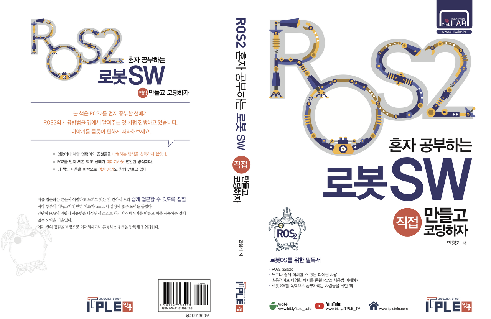
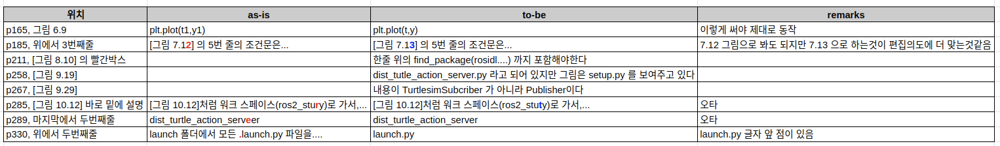

# ROS2 혼자 공부하는 로봇 SW

</img>

* 코드는 책의 제일 마지막 챕터 기준입니다.
* 이 코드를 바로 git clone 하지 마시고, 오타 등을 확인하는 용도로 사용하시면 좋겠습니다.

### 영상 강의
* 영상 강의는 계속 업로드 중입니다.
* 아래 재생목록 링크를 가지고 계시면 계속 업로드되는 상황을 확인하실 수 있습니다.

https://www.youtube.com/playlist?list=PL0xYz_4oqpvhj4JaPSTeGI2k5GQEE36oi

### 정오표 

</img>

* 위 정오표는 독자이신 "박만규"님께서 메일로 알려주신 오류를 제시한 것입니다.
* 독자 "박만규"님께 감사드리고, 또 이런 실수를 해서 여러 독자분들께 죄송합니다. 